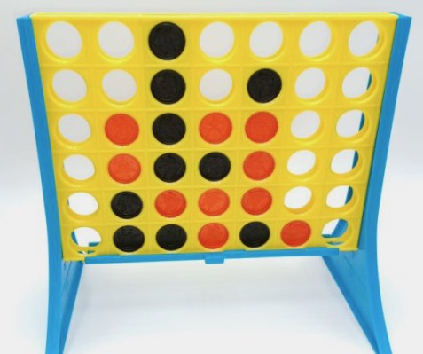

# Connect Four

Connect four of your checkers in a row while preventing your opponent from doing the same.
The game Connect Four is played by two players taking turns dropping a red or black piece into one of the columns.
When there are four of one color in a straight line (including diagonals), that player wins.
Try it out on [my website](https://www.ronsouthwick.com/c4).

## Web
The web version uses [Flask](https://flask.palletsprojects.com/en/2.2.x/).  To run locally:

* `poetry install`
* `cp .env-example .env`  (create a .env file)
* `flask run`  (runs a development server on port 8001)
* `poetry run gunicorn web.app:app --reload -c conf.py` (runs a production server on port specified in conf.py)

### Running Unit Tests
* `poetry run pytest`

## Notebook
There is a version in the `notebook` directory built to be played in a [Jupyter Notebook](https://github.com/jupyter/notebook).
#### Install
* `poetry install`
* `poetry run jupyter notebook`